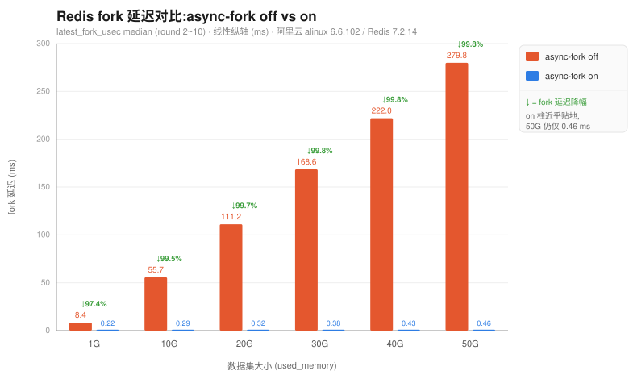
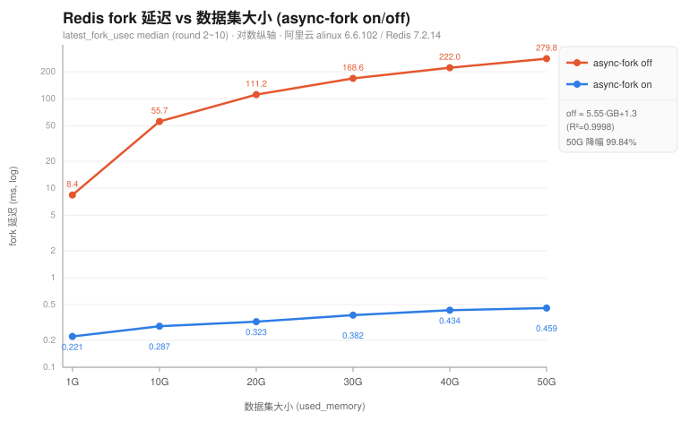

# Async-fork 对 Redis fork 延迟影响 —— 测试报告

> 一句话结论:在阿里云 alinux(内核 6.6.102-7.alnx4)上,开启 async-fork 后 Redis 的 `latest_fork_usec`(fork 冻结主线程时间)相比默认 fork **下降 97.4%~99.8%,且数据集越大收益越大**;50G 数据集时把 fork 阻塞从 ~280 ms 降到 ~0.46 ms(约 610×)。

- **测试日期**:2026-08-19
- **主机**:`112.126.80.162`(阿里云 alinux 4)
- **原始数据**:[`asyncfork-results.csv`](./asyncfork-results.csv)(12 组 × 10 轮,共 120 条采样)
- **测试方案**:[`plan-async-fork-test.md`](./plan-async-fork-test.md)

---

## 一、结论

1. **async-fork 效果显著且随内存放大**:各档 fork 延迟降幅 97.37%(1G)→ 99.84%(50G),单调递增。
2. **默认 fork 延迟与内存高度线性**:`off_median ≈ 5.55 × GB + 1.33` ms,R²=0.9998,斜率约 **5.6 ms/GB**——印证"fork 阻塞时间 ∝ 页表规模 ∝ 内存"的机制。
3. **async-fork 延迟近乎平坦**:`on_median ≈ 0.005 × GB + 0.23` ms,从 1G 到 50G 仅由 0.22→0.46 ms 缓慢爬升,基本与内存无关——页表拷贝已被移出 fork 关键路径。
4. **静止态收益上界**:1G 档即达 97.4%,远高于 Async-fork 论文(VLDB 2023)的 1GB 17.57%。差异来自测试口径:本测试为**静止态**(灌满即停写),几乎无"主动同步"退化路径,是 async-fork 的最佳工况;论文 17.57% 是**带写压测**下的 p99,含主动同步开销。二者不矛盾,分别代表收益上界与真实写负载下的收益。

---

## 二、测试环境

| 项 | 值 |
|---|---|
| 内核 | `6.6.102-7.alnx4.x86_64`(alinux 4) |
| Redis | 7.2.14(yum,x86_64,arch_bits 64) |
| CPU | Intel Xeon 6982P-C,8 vCPU(4 core × 2 thread),单 NUMA node |
| 内存 | 61 GB,**无 swap** |
| 磁盘 | 99 GB(可用 91 GB) |
| THP | `never`(全程统一,受控变量) |
| overcommit | `vm.overcommit_memory = 1` |
| async-fork 开关 | cgroup v2 `memory.async_fork`(`echo 1/0`,运行时生效,无需重启) |

> **版本正交性**:async-fork 是**内核 + cgroup** 特性,BGSAVE 子进程继承父进程 cgroup 后即受 `memory.async_fork` 治理,与 Redis 版本无关,故 7.2.14 不影响结论。

---

## 三、测试方法

- **主指标**:`latest_fork_usec`(Redis `INFO stats`)——fork() 系统调用冻结主线程的微秒数,每次 BGSAVE 后刷新。它只计 fork 调用本身,与后续 RDB 落盘时间无关,是最干净的对比指标。
- **触发方式**:仅用 `redis-cli BGSAVE` 手动触发;轮询 `rdb_bgsave_in_progress` 归零后读值,固定 sleep 3s 再进入下一次。
- **数据状态**:**静止态**——每档灌满目标 `used_memory` 后**停止一切写入**,再反复 BGSAVE。
- **采样**:每(档 × on/off)采 10 次,**丢弃 round=1**(冷启动预热),取 round 2~10 共 9 个样本统计。
- **数据结构**:string,`--data-size 1024`(1KB 定长),`--key-pattern S` 顺序灌,单一 key-prefix,无撞 key。
- **档位推进**:增量累加(1G→10G→…→50G,只补灌差量),同一台机器内每档「先 off×10 → 后 on×10」紧邻对比,消除顺序与机器差异。
- **矩阵**:数据集 1G/10G/20G/30G/40G/50G × async-fork on/off = **6 档 × 2 = 12 组**。

灌数据命令(示例,补灌到 10G 档):

```bash
./redis-benchmark-go -a 127.0.0.1:6379 --ops 0 -c 16 --pipeline 64 \
  --key-pattern S --data-size 1024 -t string \
  --key-minimum 1100001 --key-maximum 8000000 -d 1200s
```

采样脚本 `sample_fork.sh`(单档单状态调用一次):轮询 BGSAVE 完成 → 读 `latest_fork_usec`/`used_memory` → 写 CSV → sleep 3s,循环 10 次。开关切换:`echo 0/1 > /sys/fs/cgroup/redis_test/memory.async_fork`。

---

## 四、实测结果

### 4.1 汇总(median,单位 ms,基于 round 2~10)

| 数据集 | used_memory | off median | on median | **降幅** | off max | on max |
|---|---|---|---|---|---|---|
| 1G  | 1.49 GB  | 8.39 ms   | 0.221 ms | **97.37%** | 9.11 ms   | 0.240 ms |
| 10G | 10.02 GB | 55.66 ms  | 0.287 ms | **99.48%** | 56.38 ms  | 0.310 ms |
| 20G | 20.03 GB | 111.17 ms | 0.323 ms | **99.71%** | 111.95 ms | 0.354 ms |
| 30G | 30.11 GB | 168.58 ms | 0.382 ms | **99.77%** | 169.92 ms | 0.411 ms |
| 40G | 40.07 GB | 221.99 ms | 0.434 ms | **99.80%** | 224.37 ms | 0.459 ms |
| 50G | 50.27 GB | 279.82 ms | 0.459 ms | **99.84%** | 281.62 ms | 0.494 ms |

### 4.2 完整分位统计(µs,n=9,round 2~10)

| 数据集 | 状态 | min | mean | median | p99 | max |
|---|---|---|---|---|---|---|
| 1G  | off | 8018   | 8401   | 8393   | 9111   | 9111   |
| 1G  | on  | 210    | 222    | 221    | 240    | 240    |
| 10G | off | 55224  | 55672  | 55661  | 56382  | 56382  |
| 10G | on  | 249    | 285    | 287    | 310    | 310    |
| 20G | off | 109065 | 110848 | 111174 | 111946 | 111946 |
| 20G | on  | 291    | 324    | 323    | 354    | 354    |
| 30G | off | 166810 | 168552 | 168581 | 169918 | 169918 |
| 30G | on  | 372    | 387    | 382    | 411    | 411    |
| 40G | off | 221240 | 222359 | 221993 | 224367 | 224367 |
| 40G | on  | 425    | 436    | 434    | 459    | 459    |
| 50G | off | 278566 | 279979 | 279822 | 281615 | 281615 |
| 50G | on  | 433    | 459    | 459    | 494    | 494    |

### 4.3 对比图(median;off vs on 分组柱状,线性纵轴)



> 线性纵轴下 off 柱随内存节节攀高,on 柱几乎贴地——直观表达 async-fork 把 fork 冻结压到近乎为零;每组顶部标注该档的延迟降幅。

### 4.4 趋势图(median,对数纵轴;看清 on 曲线的缓升)



> 对比图看"差距量级",趋势图看"随内存的变化规律":取对数后 on 那条亚毫秒曲线的缓慢线性上升(0.22→0.46 ms)才显现出来,off 则是陡峭线性(R²=0.9998)。

- **off 拟合**:`y = 5.547·GB + 1.328` ms,R² = **0.9998**(近乎完美线性)。
- **on 拟合**:`y = 0.0049·GB + 0.228` ms(斜率仅 off 的 ~1/1100,近似平坦)。
- **50G 处 off/on median 比值 ≈ 610×**。

---

## 五、分析

1. **机制吻合**。默认 fork 需逐级同步拷贝整张页表(PGD→PUD→PMD→PTE),该拷贝随内存线性增长且占 fork 总耗时的绝大部分——off 曲线的 R²=0.9998 线性、5.6 ms/GB 斜率正是页表拷贝的直接体现。async-fork 只用 "Fast" 拷顶层 PGD/PUD 并把 PMD 置写保护后立即返回,PMD/PTE 交子进程异步 "Slow" 拷,故 on 曲线与内存几乎无关。

2. **静止态是收益上界**。父进程在子进程拷完前修改未拷 PMD/PTE 才触发"主动同步"(退化路径)。本测试灌满即停写,主动同步几乎为零,因此 1G 档就到 97%。真实线上带写流量时,收益会低于此上界(参见论文 1GB 17.57%),但高内存档位(降幅本就 >99%)受影响很小。

3. **样本稳定**。每组 9 样本极稳:off 组内抖动 <3%,on 组内抖动 <10%,max≈median,静止态无写入干扰,结论可信度高。丢弃的 round=1 冷启动值明显偏高(如 10G/off round1=78 ms vs median 55.7 ms;50G/off round1=308 ms vs median 279.8 ms),验证了预热丢弃的必要性。

---

## 六、结论与建议

- **结论**:阿里云 alinux 的 async-fork 对 Redis fork 延迟有决定性优化,**数据集越大收益越大**;大内存实例(数十 GB)开启后可将 BGSAVE/主从全量同步/AOF 重写时的主线程冻结从数百 ms 降至亚毫秒级,显著削减 fork 引发的请求毛刺。
- **建议**:大内存 Redis 实例在支持 async-fork 的 alinux 上应默认开启(cgroup v2 `memory.async_fork=1`);同时保持 THP=`never`。写压力大的实例建议再补一轮**带写负载**的对比,量化主动同步退化路径在真实工况下的收益折损。

---

## 七、复现附录

**环境准备**
```bash
echo never > /sys/kernel/mm/transparent_hugepage/enabled
sysctl -w vm.overcommit_memory=1
mkdir -p /sys/fs/cgroup/redis_test              # cgroup v2
redis-server --save '' --appendonly no --daemonize yes --dir /data/redis
echo <redis_pid> > /sys/fs/cgroup/redis_test/cgroup.procs
```

**单档执行**(数据已灌到位并停写)
```bash
echo 0 > /sys/fs/cgroup/redis_test/memory.async_fork   # off
./sample_fork.sh 127.0.0.1:6379 <档位> off results.csv
echo 1 > /sys/fs/cgroup/redis_test/memory.async_fork   # on
./sample_fork.sh 127.0.0.1:6379 <档位> on  results.csv
```

**CSV 表头**:`mem_label,used_memory_bytes,async_fork,round,latest_fork_usec,timestamp`
> 分析丢弃每组 round=1(预热),取 round 2~10 共 9 个样本。
